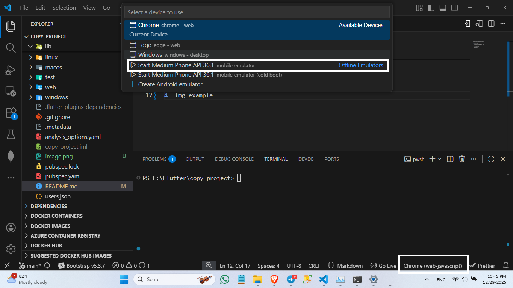

### 📦 Order Status Flow (Simulation Mode)

This is a **demo/simulation** of real-time order tracking. The order automatically progresses through the following stages:

| Step | Status                | Emoji       | Time After Confirmed |
|------|-----------------------|-------------|----------------------|
| 1    | Order Confirmed       | ✅         | Immediate (0s)       |
| 2    | Preparing Your Food   | 👨‍🍳         | ~10 seconds          |
| 3    | On The Way            | 🚗         | ~20 seconds          |
| 4    | Delivered             | 📦         | ~30 seconds          |

> **Note**: 
> - "Pending Payment" is not displayed in this tracking screen (it would appear earlier in the checkout flow).
> - This is a **simulated progression** for demo purposes only.

### ⏰ Timing Configuration

The status updates every **10 seconds** using a `Timer.periodic`. When the order reaches "Delivered", the timer stops.

File: `lib/screens/order_tracking_page.dart`

```dart
void _startStatusSimulation() {
  _timer = Timer.periodic(const Duration(seconds: 10), (timer) {
    if (_currentStep < 4) {
      setState(() {
        _currentStep++;
        switch (_currentStep) {
          case 2:
            widget.order.status = OrderStatus.preparing;
            break;
          case 3:
            widget.order.status = OrderStatus.onTheWay;
            break;
          case 4:
            widget.order.status = OrderStatus.delivered;
            timer.cancel(); // Stop updates after delivery
            break;
        }
      });
    }
  });
}
```

How to run project in flutter?

1. Open terminal >> go to your directery or go to your folder >>then write this command -- flutter run --

2. If you want to run simulator andriod you must select simulator first. 
Step3 and Step4 will be explain you more and detail.

3. Using this command for run
    ```
    flutter clean    
    flutter pub get
    flutter run

    ```

4. Img example. 
After you see and then you practice select you must run this command as below :
Using this command for run
    ```
    flutter clean    
    flutter pub get
    flutter run

    ```
+ Remember when you run on simulator you must run above command again because it is not auto refresh when you add the new line of code. So you need run again.
    ```
    flutter clean    
    flutter pub get
    flutter run

    ```

How to use git hup?

- git init ( using for initialize a new Git repository in your project folder.)
- git add .
- git commit -m "Init"
- git push

+ example add link with git hup
- git remote add origin https://github.com/JAVERSSER/food_delivery.git
We using this command because we not yet add link to git hup.
So this one is how to add link with git hup after that we can using command above
for add source code to git git hup.

+ How to clone project another one?
- git clone + link another one source code.


------------------------------------------------------
Thank you so much for reading. Appriciate you so much.
------------------------------------------------------